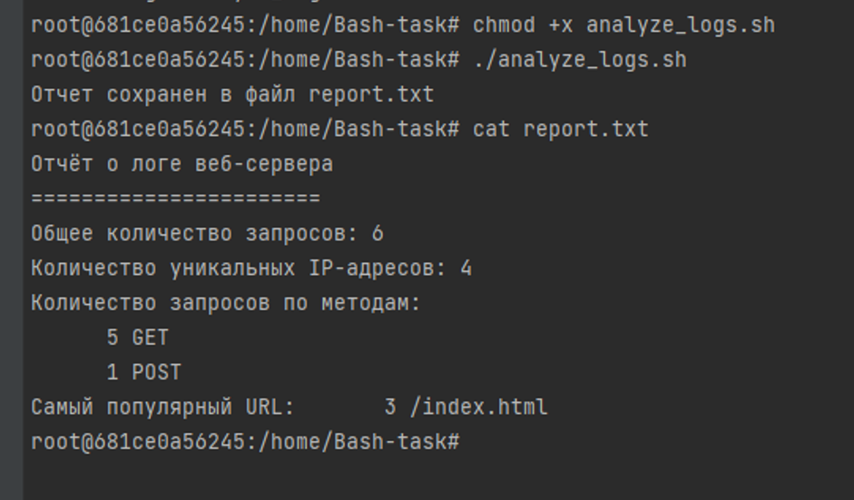

# Bash-analyze

## Содержание

[analyze_logs.sh](https://github.com/Lappa-EV/Bash-analyze/blob/main/analyze_logs.sh) — это файл со скриптом на Bash, который анализирует логи веб-сервера, предоставляя полезную информацию о запросах. С помощью этого инструмента можно получить сведения о количестве запросов, уникальных IP-адресах, распределении HTTP методов и самой популярной странице;

[access.log](https://github.com/Lappa-EV/Bash-analyze/blob/main/access.log) - файл с логами, для тестирования analyze_logs.sh;

[report.txt](https://github.com/Lappa-EV/Bash-analyze/blob/main/report.txt) - файл, который должен получиться при выполнении analyze_logs.sh;

[example.png](https://github.com/Lappa-EV/Bash-analyze/blob/main/example.png) - пример ввода команд и вывовода результата работы файла analyze_logs.sh;

## Особенности

- Подсчет общего числа запросов
- Вычисление количества уникальных IP-адресов
- Анализ числа запросов по HTTP методам (GET, POST и т.д.)
- Определение самой запрашиваемой URL-адресы

## Установка

1. **Клонируйте репозиторий**:
```bash
   git clone https://github.com/Lappa-EV/Bash-analyze
```

2. **Перейдите в директорию проекта**:
```bash
   cd Bash-analyze
```

3. **Используйте файл access.log с тестовыми данными или создайте свой access.log и используйте свои логи**:
```bash
   cat <<EOL > access.log
   192.168.1.1 - - [28/Jul/2024:12:34:56 +0000] "GET /index.html HTTP/1.1" 200 1234 
   192.168.1.2 - - [28/Jul/2024:12:35:56 +0000] "POST /login HTTP/1.1" 200 567 
   192.168.1.3 - - [28/Jul/2024:12:36:56 +0000] "GET /home HTTP/1.1" 404 890 
   192.168.1.1 - - [28/Jul/2024:12:37:56 +0000] "GET /index.html HTTP/1.1" 200 1234 
   192.168.1.4 - - [28/Jul/2024:12:38:56 +0000] "GET /about HTTP/1.1" 200 432 
   192.168.1.2 - - [28/Jul/2024:12:39:56 +0000] "GET /index.html HTTP/1.1" 200 1234 
   EOL
```
4. **Сделайте скрипт исполняемым**:
```bash
   chmod +x analyze_logs.sh
```

## Использование

Запустите скрипт для анализа логов:
```bash
  ./analyze_logs.sh
```
После выполнения скрипта будет создан файл report.txt, содержащий результаты анализа логов:
```bash
  Общее количество запросов: 6
  Количество уникальных IP-адресов: 4
  Количество запросов по методам:
        4 GET
        2 POST
  Самая популярная URL: /index.html
```

## Пример ввода команд и вывовода результата работы файла analyze_logs.sh




## Требования

 - Bash
 - Unix-подобная операционная система (Linux, macOS)


Автор: Катерина Лаппа


